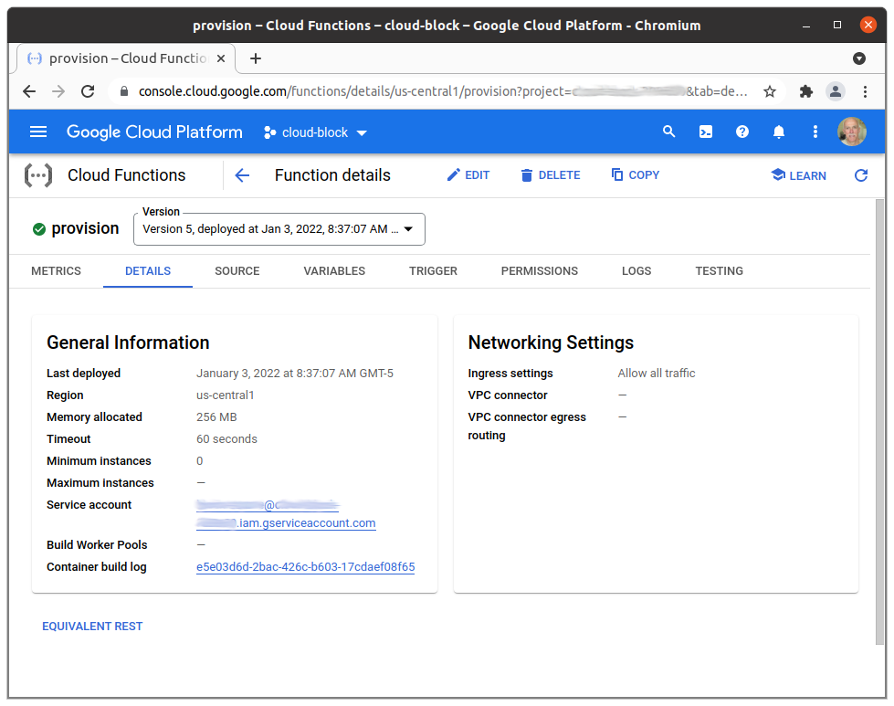

# Google Cloud Function for IoT Device Provisioning

This Cloud Function allows you to provision and synchronize a balena device with Google Cloud IoT Core in a secure and automated way via an HTTP endpoint. The Cloud Function may be called by a balena device, as seen in the [cloud-relay](https://github.com/balena-io-examples/cloud-relay) example.

| HTTP Method | Action |
|-------------|--------|
| POST | Provisions a balena device with IoT Core. First the function verifies the device UUID with balenaCloud. Then it creates a public/private key pair and adds the device to the registry. Finally the function pushes the private key to a balena device environment variable. |
| DELETE | Removes a balena device from the IoT Core registry and removes the balena device environment variable for the private key. Essentially reverses the actions from provisioning with HTTP POST. |

## Setup and Testing
### Google Cloud setup
The Cloud Function interacts with Google Cloud IoT Core via client code operating with service account credentials. You must setup a Google Cloud project with an IoT Core registry. The service account must have the *Cloud IoT Provisioner* role to manage device records in the IoT Core registry. See the IoT Core [documentation](https://cloud.google.com/iot/docs/how-tos) for more background.

### Development setup
Clone this repo
```
$ git clone https://github.com/balena-io-examples/gcp-iot-provision
```

The sections below show how to test the Cloud Function on a local test server and deploy to Cloud Functions. In either case you must provide the environment variables in the table below as instructed for the test/deployment.

| Key         |    Value    |
|-------------|-------------|
| RESIN_EMAIL | for balena login |
| RESIN_PASSWORD | for balena email address |
| GCP_PROJECT_ID | Google Cloud project ID, like `my-project-000000`|
| GCP_REGION | Google Cloud region for registry, like `us-central1` |
| GCP_REGISTRY_ID | Google Cloud registry ID you provided to create the registry |
| GCP_SERVICE_ACCOUNT |base64 encoding of the JSON formatted GCP service account credentials provided by Google when you created the service account. Example below, assuming the credentials JSON is contained in a file.<br><br>`cat <credentials.txt> \| base64 -w 0` |


### Test locally
The Google Functions Framework is a convenient tool for local testing. 
First, start a local HTTP server ([docs reference](https://cloud.google.com/functions/docs/running/function-frameworks)) using a script like below.

```
export RESIN_EMAIL=<...>
... <other environment variables from table above>
export GCP_SERVICE_ACCOUNT=<...>

npx @google-cloud/functions-framework --target=provision
```

Next, use `curl` to send an HTTP request to the local server to provision a device. The provided UUID must be for a legitimate device.

```
curl -X POST http://localhost:8080 -H "Content-Type:application/json" \
   -d '{ "uuid": "<device-uuid>" }'
```

After a successful request, you should see the device appear in your IoT Core registry and a `GCP_PRIVATE_KEY` variable appear in balenaCloud for the device.

## Deploy
To deploy to Cloud Functions, use the command below. See the [command documentation](https://cloud.google.com/sdk/gcloud/reference/functions/deploy) for the format of `yaml-file`, which contains the variables from the table in the *Development setup* section above.

```
gcloud functions deploy provision --runtime=nodejs14 --trigger-http \
   --env-vars-file=<yaml-file> --allow-unauthenticated \
   --service-account=<name>@<xxxx>.iam.gserviceaccount.com
```

The result is a Cloud Function like below. Notice the `TRIGGER` tab, which provides the URL for the function.


